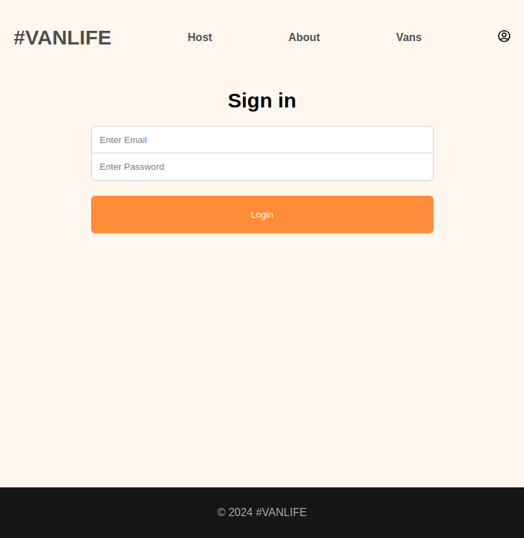

- [Introduction](#introduction)
  - [Concepts Learned](#concepts-learned)
    - [Components](#components)
    - [Shared UI](#shared-ui)
    - [Nested Routing](#nested-routing)
    - [Fetching API Data](#fetching-api-data)
    - [Loaders](#loaders)
    - [Parallel Loaders](#parallel-loaders)
    - [Filtering and Searching](#filtering-and-searching)
    - [Error Handling](#error-handling)
    - [Form Action](#form-action)
    - [Authentication and Protected Routes](#authentication-and-protected-routes)

# Introduction

This is my first project with react, but wanted to make multiple pages (as any web app is about) then found this beautiful library.
React Router is a library in React that has so many advantages, you can make routes, nested routes, shared ui, shared state, loading data, parallel loading, and much more...
React Router is the main focus in this application, it was made by following [This Course](https://www.youtube.com/watch?v=nDGA3km5He4&pp=ygUZZnJlZWNvZGVjYW1wIHJlYWN0IHJvdXRlcg%3D%3D) on [FreeCodeCamp](https://www.youtube.com/@freecodecamp) Channel on Youtube.
This was a project for educational purposes only.

## Concepts Learned

### Components

As any web app, you should divide it into reusable components, things like buttons, links, error message, loading screen, etc...
By doing this, the code will be more

### Shared UI

Shared UI isn't just making and using components, it's about the rerendering of the UI. This will rerender only the wanted components to rerender, things like nav bar is a shared ui and won't be rerender every time any value changes in the main page.

### Nested Routing

The Concept of Nested Routes is by inserting route inside a different route, this can be beneficial in many cases, like navigation bar, side drawers, etc...
You can find it here

### Fetching API Data

External data sources is essential in any web app, but not every time you would have your backend ready, So alternative exist, in this app we used [MirageJS](https://miragejs.com/), it's a way of making fake apis to ensure the lifecycle ig working. Once you backend finishes, you will replace this by this and voala!

### Loaders

The Concept of loaders is having all the data fetched before the pages loads, so when the page loads, you will access to all data you want. So always you'll assume that you have the data when the page renders. Meaning that you don't have to see error and loading states manually in every page.

### Parallel Loaders

With having loaders, you can have multiple loaders work at the same time, multiple requests, multiple renders, etc...
With this you will have much more attractive user experience. This can be in Dashboards and any similar use cases.

### Filtering and Searching

Almost every web app has filtering and searching feature, and this does too, by using query parameters you can implement filtering with ease, just be considerate for some corner cases and user experiences.

### Error Handling

The same idea with a loader, with using React Router you can implement error handling simply by adding errorElement to the routes you want to add handling to.

### Form Action

Forms have multiple ways to make and validate, here there is a concept that spectacularly reduce the amount of code you enter, which is form actions, with this you can perform all what you want without the need of handling every input state and renders.

### Authentication and Protected Routes

As any other (for the last time :D) any app must have authentication mechanism, here we used the advantage of using loaders to protect some routes by adding middleware in them, enabling some extra functionality of getting what we want without writing code in every page.
TODO: Auth middleware

